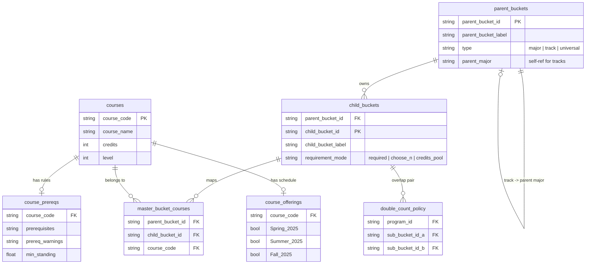

# MarqBot

Your degree-planning buddy at Marquette. MarqBot knows what you've taken, what you still need, and what you should take next — so you can stop spiraling over CheckMarq at 2am.

Built by a Marquette student who got tired of the spreadsheet life.

---

## What Does MarqBot Actually Do?

You tell MarqBot your major and what classes you've finished. It tells you what to take next. That's it. No fluff, no 47-tab spreadsheet, no guessing which FINA class unlocks what.

- **"What should I take next?"** — Get a ranked list of courses tailored to your major, track, and progress
- **"Can I even take this?"** — Search any course and instantly find out if you meet the prereqs
- **"How close am I to graduating?"** — See your degree progress broken down by every requirement bucket
- **"Plan my whole life"** — Map out up to 8 semesters ahead (yes, including summer if you're that ambitious)
- **"Will I get blocked?"** — Prereq and standing warnings before you hit a wall junior year
- **"What's my standing?"** — Tracks your Freshman / Sophomore / Junior / Senior status across your plan

---

## How It Works (30 seconds, seriously)

1. Pick your major (and concentration/track if you have one)
2. Type in courses you've already taken or are taking right now
3. Hit **Get Recommendations** — MarqBot does the rest

No account needed. No login. Just answers.

---

## Good to Know

- MarqBot is a **planning tool** — not CheckMarq, not DegreeWorks, not your advisor. Always double-check with your actual advisor before enrolling.
- Recommendations are **100% consistent** — same courses in = same plan out. No AI hallucinations, no randomness, no vibes-based suggestions.
- Covers all **College of Business** majors: Finance, Accounting, AIM, Business Analytics, Human Resources, OSCM, Information Systems, Marketing, Real Estate, Business Economics, Business Administration, and International Business.
- Currently in **early pilot** — you're one of the first to use it. If something looks off, that's genuinely useful feedback.

---

## Under the Hood

For the curious (or the CS double-majors):

| Folder | What's in there |
|--------|-----------------|
| `backend/` | The brain — recommendation engine and API |
| `frontend/` | The face — what you actually click on |
| `data/` | Every course, prereq, and requirement MarqBot knows about |
| `scripts/` | Utilities for keeping the data clean |
| `tests/` | Automated tests so nothing breaks silently |
| `docs/` | Product docs, changelogs, and the data model |
| `eval/` | Benchmarks that check recommendation quality against real advisor picks |
| `infra/` | Deployment wiring |

---

## Data Model

How MarqBot thinks about your degree — programs own requirement groups, requirement groups map to courses, courses have prereqs and schedules:

The full breakdown lives in [docs/data_model.md](docs/data_model.md).

---

## What's Coming

- **AI Advisor** — A chat assistant for quick advising questions (separate from the recommendation engine — that stays deterministic)
- **Saved Plans** — Save, name, and compare different semester plans side by side
- **Discovery Themes** — MCC Discovery Theme selection baked into your recommendations
- **More minors** — Expanding minor coverage beyond Business

---

## The Fine Print

- Built by a Marquette student, for Marquette students
- The recommendation engine is fully deterministic — no LLMs, no AI guessing, just rules and data
- MarqBot is a planning companion, not a replacement for your advisor. Final enrollment decisions should always go through official university advising.
- Found a bug? Have an idea? Feedback is always welcome.

---

*We are Marquette.*
