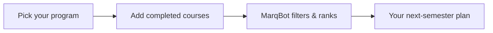

<p align="center">
  <strong>MarqBot</strong><br>
  The degree planner that reads the bulletin so you don't have to.
</p>

<p align="center">
  <a href="https://marqbot.onrender.com">marqbot.onrender.com</a>
</p>

<p align="center">
  
  
  
  
  
  
  
  
</p>

---

Built by a Marquette student who spent an entire Sunday trying to figure out one course. Now nobody else has to.

MarqBot is a planning tool for Marquette Business students. Pick your program, add what you've taken, and get a ranked plan for what to take next. No AI, no randomness — just real degree logic.

## What You Get

| Feature | What it does |
|---|---|
| **Ranked recommendations** | A priority-ordered list of what to take next semester |
| **Eligibility check** | Instant yes/no on whether you can take a course right now |
| **Progress tracking** | See where you stand across every requirement bucket |
| **Multi-semester plans** | Map out more than one term at a time |
| **Saved plans** | Snapshots stored in your browser. Come back anytime. |
| **Scheduling styles** | Grinder, Explorer, or Mixer — pick how you balance core vs. discovery |
| **Adaptive visual effects** | Keeps the richer UI on capable machines and automatically falls back to a lighter rendering mode on weaker or software-rendered browsers |
| **Feedback form** | Found a bug or have an idea? Send it from inside the app. |

Same inputs, same outputs. Every time.

## How It Works


```mermaid
flowchart LR
    A["Pick your program"] --> B["Add completed courses"]
    B --> C["MarqBot filters & ranks"]
    C --> D["Your next-semester plan"]
```

Under the hood, MarqBot runs a deterministic recommendation engine:

```
1. Filter     — removes courses you can't take yet (prereqs, standing, already done)
2. Rank       — prioritizes by tier: MCC Foundation > Business Core > Major > Track > MCC Late > Discovery
3. Pick       — fills your semester in ranked order, with caps to keep things balanced
```

Your scheduling style adjusts the balance between core requirements and discovery electives. For the full breakdown, see [docs/algorithm.md](docs/algorithm.md).

When a required or choose-from bucket collides with a broad elective pool, MarqBot counts the narrower requirement first. If two completed courses overfill the same required slot, the extra course can still spill into an eligible elective pool.
The frontend also adapts its visual effects to the device. On weaker browsers, MarqBot automatically tones down blur, glow, and heavier motion so the planner stays usable without changing the actual planning logic.

## What It Is Not

- Not CheckMarq
- Not DegreeWorks
- Not official advising

Use it to plan faster. Then confirm with your advisor before you register.

## Marquette References

- [CheckMarq Student Home](https://www.marquette.edu/student-checkmarq/)
- [Degree Progress Reports](https://www.marquette.edu/central/registrar/degree-progress.php)
- [College of Business Undergraduate Info](https://www.marquette.edu/business/undergraduate/)

## Project Directory

| Directory | What's in it |
|---|---|
| `backend/` | Flask API and recommendation engine |
| `frontend/` | Next.js student UI |
| `data/` | Course catalog, prereqs, offerings, and requirement CSVs |
| `config/` | Ranking overrides and nightly investigation queue |
| `scripts/` | Data utilities and nightly analysis |
| `tests/` | Backend (Pytest) and frontend (Vitest) tests |
| `docs/` | Changelog, algorithm notes, and working memos |

<details>
<summary><strong>Run it locally</strong></summary>

```bash
python -m venv .venv
.\.venv\Scripts\python.exe -m pip install -r requirements.txt
cd frontend
npm ci
cd ..
.\.venv\Scripts\python.exe scripts/run_local.py
```

| Task | Command |
|---|---|
| Backend only | `.\.venv\Scripts\python.exe backend/server.py` |
| Frontend dev | `cd frontend && npm run dev` |
| Backend tests | `.\.venv\Scripts\python.exe -m pytest -q` |
| Frontend checks | `cd frontend && npm run test && npm run lint && npm run build` |

</details>
