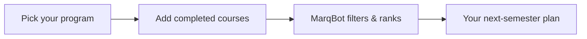

<p align="center">
  <strong>MarqBot</strong><br>
  The degree planner that reads the bulletin so you don't have to.
</p>

<p align="center">
  <a href="https://marqbot.onrender.com">marqbot.onrender.com</a>
</p>

<p align="center">
  
  
  
  
  
  
  
  
</p>

---

Built by a Marquette student who spent an entire Sunday trying to figure out one course. Now nobody else has to.

MarqBot is a planning tool for Marquette Business students. Pick your program, add what you've taken, and get a ranked plan for what to take next. No AI, no randomness — just real degree logic.

## What You Get

| Feature | What it does |
|---|---|
| **Ranked recommendations** | A priority-ordered list of what to take next semester |
| **Eligibility check** | Instant yes/no on whether you can take a course right now |
| **Progress tracking** | See where you stand across every requirement bucket |
| **Multi-semester plans** | Map out more than one term at a time |
| **Saved plans** | Snapshots stored in your browser. Compare paths and come back anytime. |
| **Scheduling styles** | Grinder, Explorer, or Mixer — pick how you balance core vs. discovery |
| **Adaptive visual effects** | Keeps the richer UI on by default and falls back to a lighter rendering mode only when reduced motion or a manual reduced-effects preference is active |
| **Feedback form** | Found a bug or have an idea? Send it from inside the app. |

Same inputs, same outputs. Every time.

## How It Works


```mermaid
flowchart LR
    A["Pick your program"] --> B["Add completed courses"]
    B --> C["MarqBot filters & ranks"]
    C --> D["Your next-semester plan"]
```

Under the hood, MarqBot runs a deterministic recommendation engine:

```
1. Filter     — removes courses you can't take yet (prereqs, standing, already done)
2. Rank       — prioritizes by tier: MCC Foundation > Business Core > Major > Track > MCC Late > Discovery
3. Pick       — fills your semester in ranked order, with caps to keep things balanced
```

Your scheduling style adjusts the balance between core requirements and discovery electives. For the full breakdown, see [How MarqBot Plans Your Degree](docs/memos/algorithm.md). For engine internals, see the [Technical Reference](docs/codebase/tech_readme.md).

When a required or choose-from bucket collides with a broad elective pool, MarqBot counts the narrower requirement first. If two completed courses overfill the same required slot, the extra course can still spill into an eligible elective pool.
The frontend also adapts its visual effects to the active preference state. When reduced motion or a manual reduced-effects preference is active, MarqBot tones down blur, glow, and heavier motion without changing the actual planning logic.

## What It Is Not

- Not CheckMarq
- Not DegreeWorks
- Not official advising

Use it to plan faster. Then confirm with your advisor before you register.

## Marquette References

- [CheckMarq Student Home](https://www.marquette.edu/student-checkmarq/)
- [Degree Progress Reports](https://www.marquette.edu/central/registrar/degree-progress.php)
- [College of Business Undergraduate Info](https://www.marquette.edu/business/undergraduate/)

## Documentation

| Doc | What it covers |
|---|---|
| [How MarqBot Plans Your Degree](docs/memos/algorithm.md) | Non-technical walkthrough of the recommendation engine, requirements, and policies |
| [Policy Guide](docs/memos/policies.md) | Navigation-first guide to scraped Marquette undergraduate policies, grouped by lifecycle with university and college-specific sections kept separate |
| [Product Overview](docs/memos/ogprd.md) | Fast product-context memo for what MarqBot is, who it serves, and what it is not |
| [Branding Notes](docs/memos/branding.md) | Brand direction, messaging, and presentation notes |
| [Technical Reference](docs/codebase/tech_readme.md) | Data inputs, pipeline internals, ranking tuples, API endpoints, module map |
| [Changelog](docs/CHANGELOG.md) | Version history and release notes |

The [`docs/memos/`](docs/memos/) folder is useful if you want fast project context without reading the whole codebase. Start with:

- [`docs/memos/algorithm.md`](docs/memos/algorithm.md) for the planner logic in plain English.
- [`docs/memos/policies.md`](docs/memos/policies.md) for bulletin-policy lookup, academic-rule validation, and college-specific policy differences.
- [`docs/memos/ogprd.md`](docs/memos/ogprd.md) for the short product framing.
- [`docs/memos/branding.md`](docs/memos/branding.md) for voice and brand direction.

## Project Directory

```
backend/                  Flask API and recommendation engine
  server.py                 API routes, request validation, policy enforcement
  data_loader.py            CSV loading, prereq overlay, equivalency maps
  allocator.py              Course-to-bucket allocation with overflow spill
  eligibility.py            Prereq, standing, stage, and restriction filtering
  semester_recommender.py   Ranking, selection, credit-load warnings
  scheduling_styles.py      Three-pass selection loop (grinder/explorer/mixer)
  requirements.py           Domain constants, double-count families, bucket helpers
  prereq_parser.py          Hard-prereq expression parser
  student_stage.py          Undergrad/grad stage filter
  unlocks.py                Prereq chain depth for bridge course ranking
  normalizer.py             Course code normalization
  validators.py             Input validation helpers

frontend/                 Next.js student UI
  src/
    app/                    Pages (onboarding, planner, courses, saved, about, ai-advisor)
    components/             UI components by feature area
      landing/                Landing page components
      onboarding/             Program selection and course entry
      planner/                Semester plan, progress, recommendations
      saved/                  Saved plan management
      about/                  About page components
      layout/                 Shared layout (navbar, footer)
      shared/                 Reusable UI primitives
    context/                React context providers
    hooks/                  Custom React hooks
    lib/                    Utility functions
  tests/                    Active frontend Vitest suite
  public/assets/            Static images and branding

data/                     CSV course catalog (manual edits only)
  courses.csv               Base course catalog with credits, level, description
  parent_buckets.csv        Program envelopes (majors, minors, tracks, universal)
  child_buckets.csv         Individual requirements inside each parent
  master_bucket_courses.csv Explicit course-to-bucket membership
  course_hard_prereqs.csv   Hard prerequisite graph edges
  course_soft_prereqs.csv   Warning-only and manual-review prereq metadata
  course_equivalencies.csv  Honors, cross-list, and no-double-count relationships
  course_offerings.csv      Term availability history (retained for future offering-aware planning)
  policies.csv              Normalized academic policy registry (76 policies)
  policies_buckets.csv      Policy-to-bucket join table (177 mappings)
  quips.csv                 Rotating UI quips

config/                   Runtime configuration
  ranking_overrides.json    Manual priority overrides for specific courses

scripts/                  Data utilities and local maintenance
  run_local.py              Local dev server launcher
  ensure_frontend_build.py  Frontend build presence check
  discover_equivalencies.py Equivalency discovery utility
  compile_quips.py          Quip compilation
  validate_track.py         Track validation checks
  scrape_undergrad_policies.py Bulletin policy scrape utility
  eval_advisor_match.py     Advisor-match evaluation utility

tests/                    Test suites
  backend/                  Pytest backend tests
  frontend/                 Legacy frontend test root
  nightly_reports/          Archived nightly analysis reports

docs/                     Documentation
  CHANGELOG.md              Version history
  codebase/                 Technical reference and generated codebase maps
  memos/                    Useful product, policy, algorithm, and branding memos for fast project context
  feedbacks/                Collected feedback records

infra/                    Infrastructure
  docker/                   Docker configuration
```

<details>
<summary><strong>Run it locally</strong></summary>

```bash
python -m venv .venv
.\.venv\Scripts\python.exe -m pip install -r requirements.txt
cd frontend
npm ci
cd ..
.\.venv\Scripts\python.exe scripts/run_local.py
```

| Task | Command |
|---|---|
| Backend only | `.\.venv\Scripts\python.exe backend/server.py` |
| Frontend dev | `cd frontend && npm run dev` |
| Backend tests | `.\.venv\Scripts\python.exe -m pytest tests/backend -q` |
| Frontend checks | `cd frontend && npm run test && npm run lint && npm run build` |

Production notes:
- `render.yaml` is the checked-in Render Blueprint for the monolith deploy.
- Production feedback is written to `FEEDBACK_PATH` on the mounted Render disk at `/var/data/marqbot/feedback.jsonl`.
- `/api/health` is a readiness check and returns `503` until the static frontend export is present.

</details>
