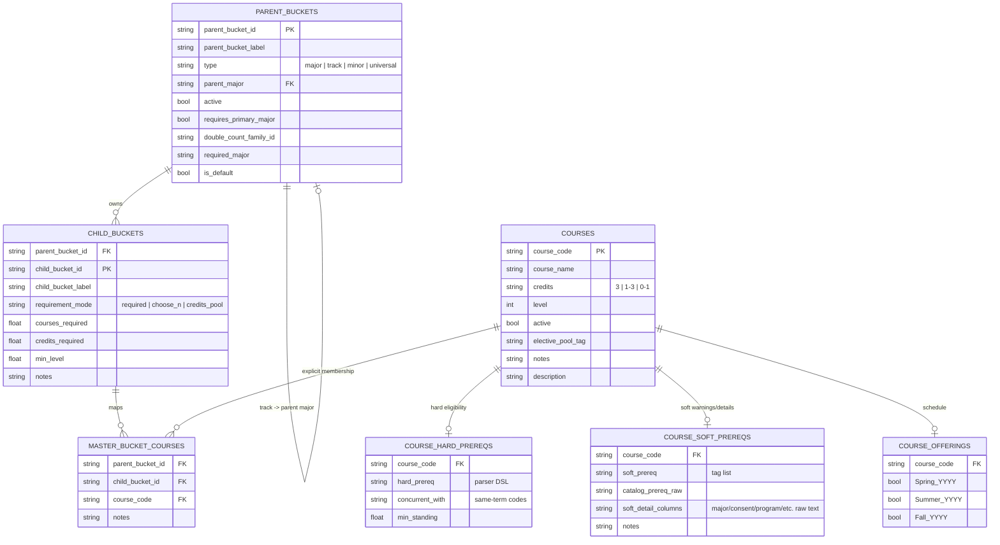

# MarqBot Data Model

All checked-in runtime inputs live in `data/` as UTF-8-BOM CSVs. The loader builds two runtime structures:
- a course catalog overlay (`courses.csv` + prereqs + offerings)
- a parent/child requirement graph (`parent_buckets.csv` + `child_buckets.csv` + `master_bucket_courses.csv`)

## Runtime Assembly

```mermaid
flowchart LR
    classDef catalog fill:#eef6ff,stroke:#3b82f6,color:#0f172a,stroke-width:1px;
    classDef prereq fill:#f0fdf4,stroke:#16a34a,color:#14532d,stroke-width:1px;
    classDef graph fill:#fff7ed,stroke:#ea580c,color:#7c2d12,stroke-width:1px;
    classDef runtime fill:#fdf4ff,stroke:#a21caf,color:#581c87,stroke-width:1px;

    subgraph Catalog[Course Catalog Overlay]
        C[courses.csv]
        HP[course_hard_prereqs.csv]
        SP[course_soft_prereqs.csv]
        O[course_offerings.csv]
    end

    subgraph Requirements[Parent/Child Requirement Graph]
        PB[parent_buckets.csv]
        CB[child_buckets.csv]
        MBC[master_bucket_courses.csv]
    end

    C --> RC[runtime courses_df]
    HP --> RC
    SP --> RC
    O --> RC

    PB --> BG[runtime bucket graph]
    CB --> BG
    MBC --> BG
    C --> DYN[dynamic elective synthesis\nbiz_elective -> credits_pool only]
    CB --> DYN
    DYN --> BG

    RC --> ENG[allocator + eligibility + recommendations]
    BG --> ENG

    class C,O catalog;
    class HP,SP prereq;
    class PB,CB,MBC,DYN graph;
    class RC,BG,ENG runtime;
```

## Entity Relationships



## Core CSVs

| File | Role |
|------|------|
| `courses.csv` | Base course catalog. |
| `parent_buckets.csv` | Top-level programs: major, track, minor, universal. |
| `child_buckets.csv` | Requirement buckets within each parent. |
| `master_bucket_courses.csv` | Explicit course membership for child buckets. |
| `course_hard_prereqs.csv` | Hard eligibility gates only. |
| `course_soft_prereqs.csv` | Soft warnings, raw prerequisite text, and audit detail columns. |
| `course_offerings.csv` | Seasonal offering history used for recommendation filtering. |

## Parent/Child Program Model

**Program types** (`parent_buckets.type`)

| Type | Example | Behavior |
|------|---------|----------|
| `major` | Finance, Accounting | Selectable primary or secondary program, depending on flags. |
| `track` | Corporate Banking, CFA | Scoped to a parent major via `parent_major` and often gated by `required_major`. |
| `minor` | Business Administration minor | Optional secondary program. |
| `universal` | BCC Core, MCC Foundation | Auto-included for all students. |

**Program gating/defaults** (`parent_buckets.required_major`, `parent_buckets.is_default`, `parent_buckets.requires_primary_major`)

| Field | Meaning |
|------|---------|
| `required_major` | Optional parent major that must be declared to use this program. |
| `is_default` | Default major when the user has not chosen one yet. |
| `requires_primary_major` | Program can only exist alongside a primary major, not as a standalone primary selection. |

**Requirement modes** (`child_buckets.requirement_mode`)

| Mode | Rule |
|------|------|
| `required` | All mapped courses must be completed. |
| `choose_n` | Pick `courses_required` courses from the mapped set. |
| `credits_pool` | Accumulate `credits_required` credits from eligible mapped or synthesized courses. |

**Overlap default**

- child buckets in the same `double_count_family_id` do not double-count by default
- child buckets in different families do double-count by default
- the removed `double_count_policy.csv` was the optional explicit override sheet for exceptions; it is not part of the checked-in data model right now

## Prerequisite Split

### `course_hard_prereqs.csv`

| Column | Meaning |
|--------|---------|
| `course_code` | Owning course. |
| `hard_prereq` | Parseable prerequisite expression consumed by `prereq_parser`. |
| `concurrent_with` | Same-term companion courses. |
| `min_standing` | Numeric standing gate. |

### `course_soft_prereqs.csv`

| Column | Meaning |
|--------|---------|
| `course_code` | Owning course. |
| `soft_prereq` | Semicolon-delimited tag list used by runtime warnings and manual review. |
| `catalog_prereq_raw` | Full bulletin prerequisite line. |
| `notes` | Human-readable audit context retained from parsing. |

**Soft detail columns**

| Column | Captures |
|--------|----------|
| `soft_prereq_major_restriction` | Major or minor restriction text. |
| `soft_prereq_instructor_consent` | Instructor, department chair, or program director consent text. |
| `soft_prereq_admitted_program` | Admission-to-program language. |
| `soft_prereq_college_restriction` | College-enrollment restrictions. |
| `soft_prereq_program_progress_requirement` | Completed credits or progress-in-program thresholds. |
| `soft_prereq_standing_requirement` | Standing phrases such as sophomore, junior, or senior standing. |
| `soft_prereq_placement_required` | Placement-based restrictions. |
| `soft_prereq_minimum_grade` | Minimum grade language. |
| `soft_prereq_minimum_gpa` | GPA language. |
| `soft_prereq_may_be_concurrent` | Explicit concurrent-course phrasing. |
| `soft_prereq_other_requirements` | Remaining non-hard prerequisite text worth preserving. |
| `soft_prereq_complex_hard_prereq` | Raw text when hard prerequisite logic was too complex to encode safely. |

## Excluded From Hard Prereq Graph

The split model intentionally keeps these out of `hard_prereq`:
- cross-listing clauses
- no-credit-together clauses
- major credit-cap notes
- previous/subsequent enrollment notes
- note-style advisories that mention course codes but do not gate eligibility

Those clauses remain in `catalog_prereq_raw`, `notes`, or soft detail columns.

## Dynamic Elective Synthesis

At load time, courses tagged with `courses.elective_pool_tag = biz_elective` are added dynamically to qualifying elective-like `credits_pool` buckets. This is runtime-only supplementation; `master_bucket_courses.csv` remains the checked-in source of explicit mappings.

## Runtime Compatibility Note

The checked-in data model no longer stores a combined `course_prereqs.csv` or a fixed `warning_text` column. Runtime compatibility fields may still exist internally, but they are derived from the split prerequisite inputs rather than stored as first-class CSV data.
