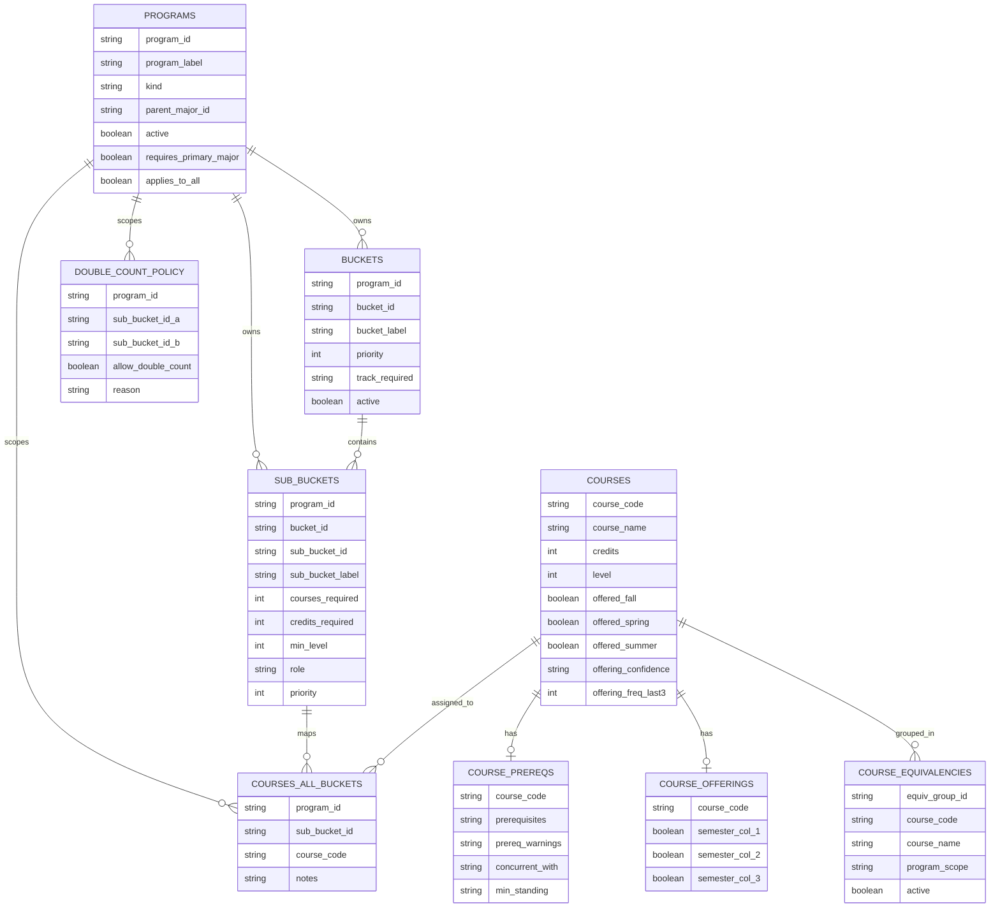

# MarqBot Data Model (v1.6)

## Visual ERD (Mermaid)

## Marquette Style Notes
- Primary color: `#003366` (Marquette navy)
- Accent color: `#FFCC00` (Marquette gold)
- Use navy for headers and relationship labels; use gold for highlights/callouts in rendered docs.
- Keep neutral backgrounds and high-contrast text for print/export readability.

## Relationship Notes
- `BCC_CORE` and `MCC_CORE` are modeled as universal programs (`applies_to_all=true`) and are auto-included at runtime.
- `courses_all_buckets` remains structurally unchanged in v1.6 for stability.
- `double_count_policy` now stores only sub-bucket pair exceptions by program scope.
- `course_offerings` uses dynamic literal semester headers in the workbook (for example `Fall 2025`); the ERD shows generic `semester_col_*` placeholders for Mermaid compatibility.
