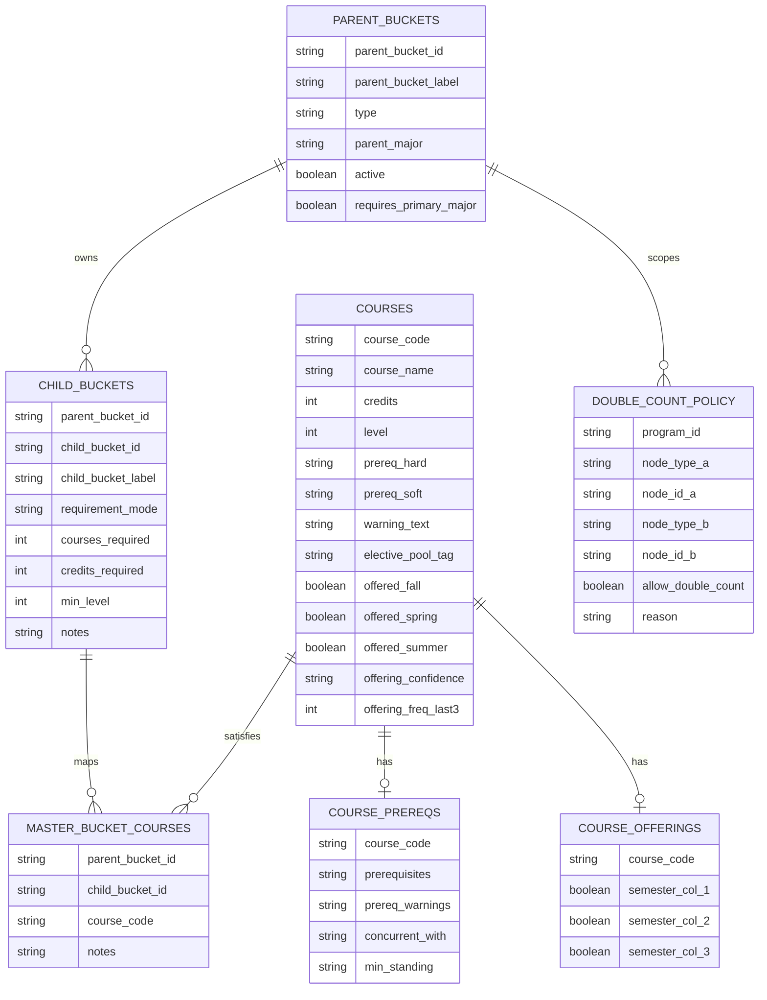

# MarqBot Data Model (v1.7.11)

## Canonical Workbook ERD (Mermaid)


## Runtime Model Flow (Mermaid)
```mermaid
flowchart TD
    A[Workbook Sheets] --> B[data_loader normalization]
    B --> C[Runtime buckets_df]
    B --> D[Runtime course_bucket_map_df]
    B --> E[courses_df + prereq_map]
    E --> F[eligibility candidate filter]
    C --> F
    D --> F
    F --> G[semester_recommender ranking]
    C --> H[allocator progress assignment]
    D --> H
    G --> I[/recommend response]
    H --> I
    H --> J[/programs progress overlays]
```

## Model Notes
- `parent_buckets.type='universal'` rows are auto-included when `active=true` (for example `BCC_CORE`, `MCC_CORE`).
- Tracks stay selectable as independent parent buckets, but `parent_major` links them to allowed major selection in UI and API.
- `requirement_mode` drives bucket behavior:
  - `required`: fixed specific courses
  - `choose_n`: choose-count lists
  - `credits_pool`: credit-based pools
- Dynamic business electives are intentionally not hard-mapped in `master_bucket_courses`:
  - runtime synthesis uses `courses.elective_pool_tag == "biz_elective"`
  - only for elective-like child IDs matching `ELEC|BUS_ELEC|ELECTIVE`
  - bucket `min_level` is enforced
- Same-family no-double-count remains default. Cross-family remains default allow. Explicit `double_count_policy` rows override defaults.
- Same-family routing prefers non-elective children (`required`, `choose_n`) before `credits_pool` children to avoid elective leakage.
- `course_equivalencies` is currently out of active governance and not part of the canonical planning model in this release line.
