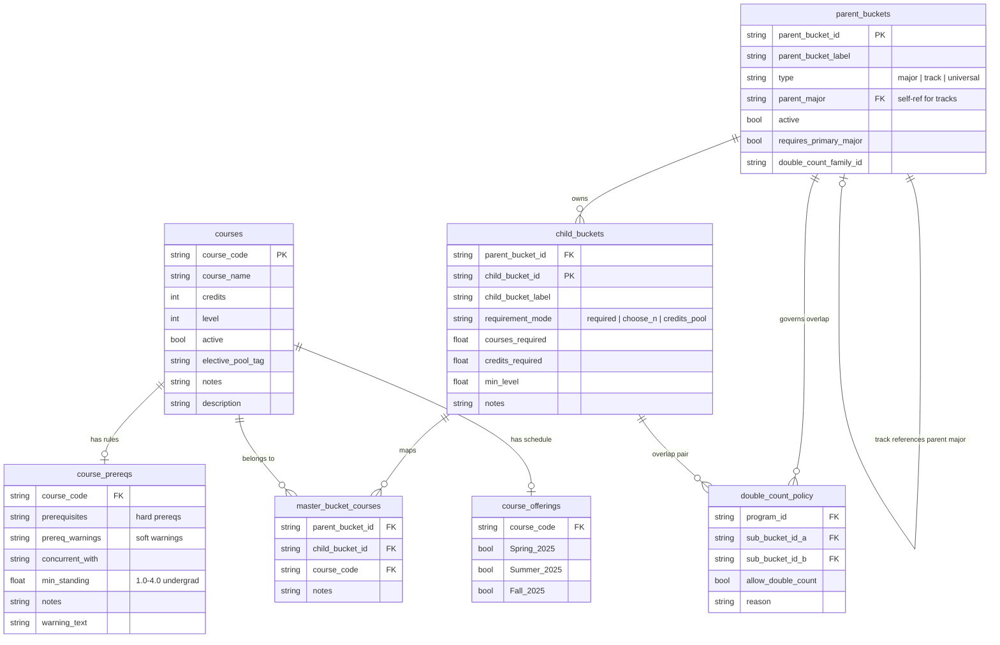

# MarqBot Data Model

All runtime data lives in `data/` as UTF-8-BOM CSVs.

## Entity-Relationship Diagram

## Key Concepts

**Program types** (`parent_buckets.type`)
| Type | Example | Behavior |
|------|---------|----------|
| `major` | Finance, Accounting | Selectable by student. Tier 2 priority. |
| `track` | Corporate Banking, CFA | Scoped to a parent major via `parent_major`. Tier 3 priority. |
| `universal` | BCC Core, MCC Foundation | Auto-included for all students. Tier 1 priority. |

**Requirement modes** (`child_buckets.requirement_mode`)
| Mode | Rule |
|------|------|
| `required` | All mapped courses must be completed |
| `choose_n` | Pick N courses from the mapped set (`courses_required`) |
| `credits_pool` | Accumulate N credits from tagged courses (`credits_required`) |

**Double-count resolution** (highest wins)
1. Explicit sub-bucket pair row in `double_count_policy`
2. Family default: same `double_count_family_id` = deny; different family = allow
